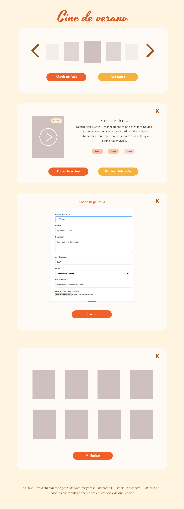
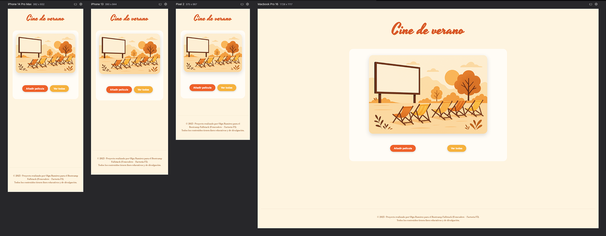
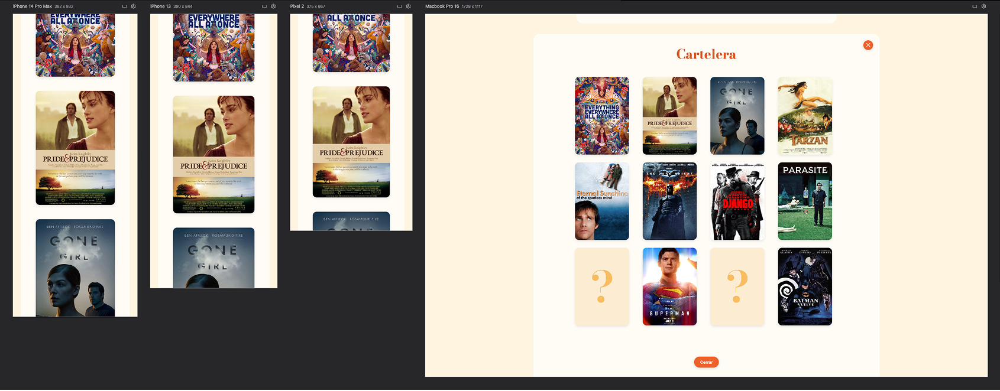
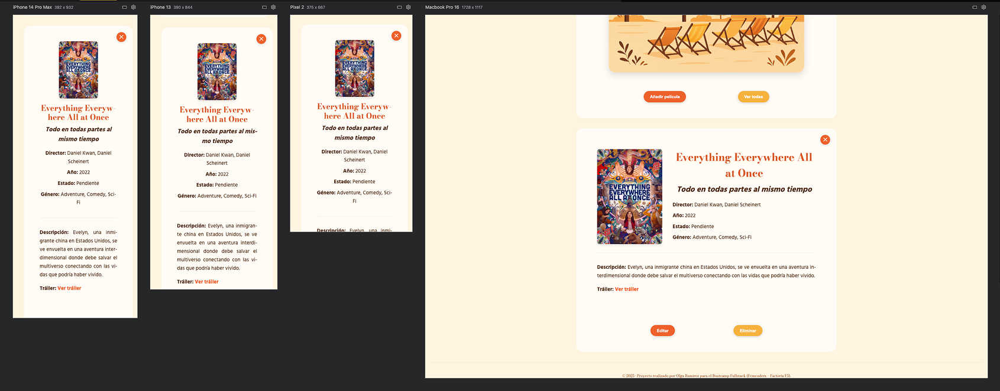
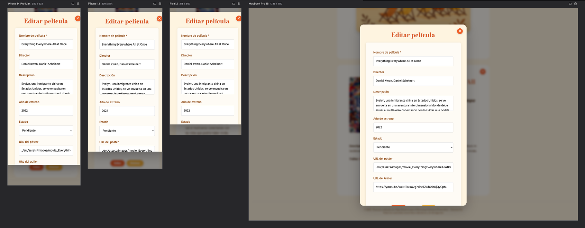
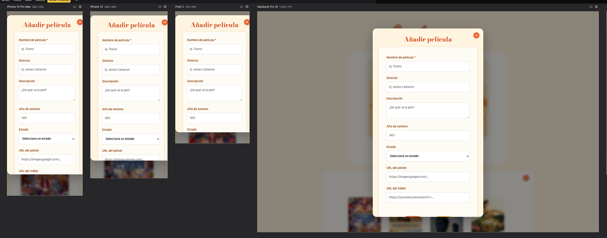

# 🎬 Cine de Verano 🍿

Una aplicación web para gestionar tu colección personal de películas, desarrollada como parte del Bootcamp de Desarrollo Web (Femcoders - Factoría F5).

## 📋 Descripción

Cine de Verano es una aplicación CRUD (Create, Read, Update, Delete) que permite a los usuarios crear y administrar su propia colección de películas. La aplicación cuenta con una interfaz intuitiva inspirada en los colores cálidos del verano y permite agregar, visualizar, editar y eliminar películas de manera sencilla.

## 🎨 Diseño

El proyecto incluye un prototipo diseñado en Figma que define la identidad visual y la experiencia de usuario de la aplicación.



### Paleta de colores
- **Fondos**: Crema vainilla (`#fff4e0`) y blanco puro (`#fefefe`)
- **Tipografía**: Naranja polvoriento (`#d95928`) y marrón chocolate (`#522c0e`)
- **Botones**: Naranja quemado (`#ef6129`) y amarillo dorado (`#f6b23e`)
- **Acentos**: Naranja atardecer (`#ff841f`)

### Tipografías utilizadas
- **Yesteryear**: Para el título principal
- **Bodoni Moda**: Para subtítulos y elementos destacados
- **Hind**: Para el texto del cuerpo y formularios

## ⚡ Características

- **Gestión completa de películas**: Añadir, ver, editar y eliminar películas
- **Interfaz modal**: Formularios emergentes para una mejor experiencia de usuario
- **Cartelera visual**: Visualización de pósters en formato grid
- **Información detallada**: Vista expandida con toda la información de cada película
- **Diseño responsivo**: Adaptado para dispositivos móviles y de escritorio
- **Validación de formularios**: Campos obligatorios y validación de URLs

## 🛠️ Tecnologías utilizadas

- **Frontend**: HTML5, CSS3, JavaScript (ES6+)
- **Backend**: JSON Server (simulación de API REST)
- **Estilos**: CSS custom properties y responsive design
- **Tipografías**: Google Fonts

## 🚀 Instalación y uso

1. **Clonar el repositorio**:
   ```bash
   git clone [url-del-repositorio]
   cd cine-de-verano
   ```

2. **Instalar JSON Server** (si no lo tienes instalado):
   ```bash
   npm install -g json-server
   ```

3. **Iniciar el servidor de datos**:
   ```bash
   json-server --watch db.json --port 3000
   ```

4. **Abrir la aplicación**:
   - Abre el archivo `index.html` en tu navegador
   - O usa Live Server si trabajas con VS Code

## 📁 Estructura del proyecto

```
cine-de-verano/
├── index.html              # Página principal
├── styles.css              # Estilos principales
├── services.js             # Lógica JavaScript y operaciones CRUD
├── db.json                 # Base de datos JSON
├── src/
│   └── assets/
│       └── images/         # Imágenes de la aplicación
└── README.md
```

## 🎯 Funcionalidades CRUD

### ✅ CREATE - Crear películas
- Modal con formulario para añadir nuevas películas
- Campos: título, director, descripción, año, estado, póster, tráiler
- Validación de campos obligatorios

### ✅ READ - Leer películas
- Cartelera con todos los pósters
- Vista detallada de cada película
- Información completa con enlace al tráiler

### ✅ UPDATE - Actualizar películas
- Edición de películas existentes
- Formulario pre-rellenado con los datos actuales
- Actualización en tiempo real

### ✅ DELETE - Eliminar películas
- Confirmación antes de eliminar
- Actualización automática de la cartelera


## Imágenes de la web












## 📱 Responsive Design

La aplicación está optimizada para diferentes tamaños de pantalla:
- **Desktop**: Grid de 4 columnas para la cartelera
- **Mobile**: Diseño en columna única, botones centrados

## 🔮 Funcionalidades futuras

Si hubiera tenido más tiempo, me habría gustado implementar:

- **Carrusel de inicio**: Carrusel con los pósters de las películas en la página principal
- **Filtros por estado**: Funcionalidad para filtrar por "Visto", "Pendiente" o "Favorito"
- **Filtros por género**: Categorización y filtrado por géneros cinematográficos
- **Reproductor integrado**: Botón de play en cada póster para ver el tráiler incrustado
- **Alertas personalizadas**: Diseño custom para las confirmaciones de añadir/editar película
- **Búsqueda**: Barra de búsqueda para encontrar películas específicas
- **Valoraciones**: Sistema de puntuación con estrellas

## 🎓 Aprendizajes

Este proyecto me ha permitido practicar:
- Operaciones CRUD con JavaScript
- Manipulación del DOM
- Trabajo con APIs REST (JSON Server)
- Diseño responsive con CSS Grid y Flexbox
- Validación de formularios
- Gestión de modales y eventos
- Organización de código JavaScript

## 👩‍💻 Desarrolladora

**Olga Ramírez**  
*Bootcamp Fullstack Development - Femcoders (Factoría F5)*

---

*Proyecto educativo desarrollado como parte del aprendizaje en tecnologías web frontend y backend.*